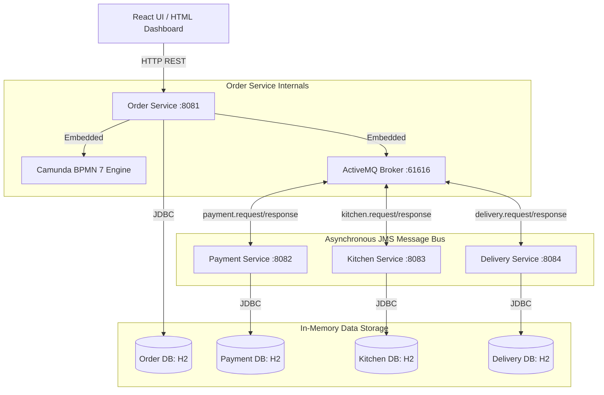

# Online Food Order Processing System

An enterprise-grade, microservice-based event-driven food ordering application implementing the **Orchestrator-based Saga Pattern** using **Spring Boot**, **Camunda BPMN 7**, **Apache ActiveMQ**, **H2/MySQL**, and **React**.

---

## 🏗️ Technical Architecture

This system utilizes an embedded Camunda BPMN workflow engine within the **Order Service** to orchestrate transactional state transitions across three participant microservices. Inter-service communications occur asynchronously over **ActiveMQ JMS Queues** with JSON serialization.

### Architecture Workflow Diagram



---

## 🛠️ Technology Stack

- **Backend core**: Spring Boot `3.2.5`
- **Workflow Orchestration**: Camunda BPMN `7.21.0` (Embedded)
- **Message Broker**: Apache ActiveMQ `6.1.2` (Embedded inside Order Service)
- **Database**: H2 Database (In-Memory, individual per microservice)
- **Frontend**: React (`18.2.0`) + Vite, TailwindCSS (for `food-order-ui`), HTML5 / Glassmorphism Vanilla CSS (for `standalone-dashboard.html`)
- **Build System**: Maven (Multi-module project structure)

---

## ✨ Features

1. **Orchestrator-based Saga Transaction Management**: Ensures data consistency across distributed microservices. If any step (like Payment) fails, Camunda triggers automated rollback compensation steps.
2. **Asynchronous JMS Queuing**: Decouples microservice workloads using ActiveMQ JMS queues for resilience and horizontal scalability.
3. **Real-time Visual Status Stepper**: Pings the Order Service every 2 seconds to transition UI state indicators from `PENDING` -> `PAID` -> `PREPARING` -> `DELIVERED`.
4. **Camunda Workflow Cockpit**: Administration UI to monitor running/completed process instances and inspect process variable maps.
5. **Interactive Dashboard**: Full-fledged menu, cart items subtotaling, handling fees calculation, and live-tracking.

---

## 📂 Project Structure

```
project01/ (Root)
├── pom.xml                         # Parent POM compiling all microservices
├── docker-compose.yml              # Optional local MySQL & ActiveMQ Docker infrastructure
├── run-all.ps1                     # PowerShell startup orchestrator script
├── run-all.bat                     # Windows Batch startup script
├── standalone-dashboard.html       # Standalone HTML dashboard with Glassmorphism
├── order-service/                  # Microservice containing Camunda BPMN & ActiveMQ Broker
├── payment-service/                # Microservice validating user credit limits
├── kitchen-service/                # Microservice tracking chef cooking statuses
├── delivery-service/               # Microservice assigning couriers and final delivery
└── food-order-ui/                  # React + Vite frontend dashboard
```

---

## ⚙️ Microservices & Workflow Architecture

### 1. Order Service (Port `8081`)
- Acts as the REST gateway for creating, querying, and updating orders.
- Embeds the **Camunda BPMN Engine** which compiles the BPMN model and correlates JMS callback messages back to active process instances.
- Starts an **embedded ActiveMQ Broker** listening on `tcp://localhost:61616`, allowing all participant microservices to connect natively without requiring standalone installs.

### 2. Payment Service (Port `8082`)
- Listens to `payment.request.queue`.
- Simulates credit limits: orders with a grand total **equal to or exceeding $500.00** fail authorization, triggering a Camunda compensation task (Saga Rollback) to cancel the order. Low values succeed.

### 3. Kitchen Service (Port `8083`)
- Listens to `kitchen.request.queue`.
- Simulates chef preparation updates and publishes a ready response back to the orchestrator.

### 4. Delivery Service (Port `8084`)
- Listens to `delivery.request.queue`.
- Assigns a courier, simulates dispatch, and publishes the final delivered event.

---

## 📊 Database Design Summary

Each service uses its own isolated H2 In-Memory database.

### Order Database (`orderdb`)
- `orders` table: Stores `id`, `customer_name`, `delivery_address`, `status` (PENDING, PAID, PREPARING, DELIVERED, CANCELLED), and `total_amount`.
- `order_items` table: Stores `id`, `item_name`, `quantity`, `price`, and references the order.

### Payment Database (`paymentdb`)
- `payments` table: Stores transaction status details.

### Kitchen Database (`kitchendb`)
- `kitchen_orders` table: Tracks cooking preparation steps.

### Delivery Database (`deliverydb`)
- `deliveries` table: Tracks assigned courier names and dispatch statuses.

---

## 🔌 API Documentation

### Create Order
- **Endpoint**: `POST /api/orders`
- **Content-Type**: `application/json`
- **Request Body**:
  ```json
  {
    "customerName": "Jane Doe",
    "deliveryAddress": "Apartment, Street Name, Area",
    "items": [
      {
        "itemName": "Paneer Butter Masala",
        "quantity": 2,
        "price": 240.00
      }
    ]
  }
  ```
- **Response**: `200 OK` (returns JSON containing order ID, total, and state).

### Fetch Order Status
- **Endpoint**: `GET /api/orders/{id}`
- **Response**: `200 OK` (returns order information and Camunda workflow state).

### Health Check
- **Endpoint**: `GET /api/orders/health`
- **Response**: `200 OK` (returns connectivity verification details).

---

## 🛠️ Setup & How to Run

### Prerequisites
- **Java 25** (or Java 21+) JDK installed.
- **Maven** installed and configured in your shell path.
- **Node.js 18+** & npm.

### Quick Start (Automatic Script)
1. Double-click or run `run-all.ps1` (or `run-all.bat`) in your root directory.
   ```powershell
   .\run-all.ps1
   ```
2. The script compiles the Java packages, launches the Order Service (which opens port `61616` and starts the embedded message broker), and spins up the remaining microservices and Vite UI automatically.
3. Open your browser and navigate to:
   - **Standalone Dashboard**: [standalone-dashboard.html](file:///e:/project01/standalone-dashboard.html)
   - **React UI**: `http://localhost:5173`
   - **Camunda BPMN Cockpit**: `http://localhost:8081/camunda` (Credentials: `admin`/`admin`)

---

## 🔮 Future Improvements
- **Security**: Integrate JWT authentication for clients placing orders.
- **Containerization**: Add Kubernetes Helm charts for distributed cloud deployments.
- **Service Discovery**: Integrate Spring Cloud Eureka for registry management.

---

## 📝 License & Authors
- **Authors**: Antigravity Developer Team
- **License**: MIT License
